# How Slack and Claude Code Talk to Agentforce
### A Plain-English Walkthrough for Business Audiences

---

## The One-Minute Version

> [!NOTE]
> **What this is:** A bridge that lets any AI client — Slack, Claude Code, Cursor, Bedrock, future tools — ask Salesforce a question in plain English like *"Summarize the Omega, Inc. account"* and get back a real answer, pulling live CRM data.

> [!TIP]
> **Why it matters:** Today Slack can already reach Salesforce for raw data via a standard connector called `sobject-all`. The next step — and the strategic ask — is to put a **governed Agentforce agent** on the same path. One agent in Salesforce. Many front doors. Governance intact.

---

## The Pieces in Play

| Piece | Role | Think of it as… |
|---|---|---|
| **Slack** | Where the business user already lives | The front door for sellers, CSMs, service reps |
| **Claude Code** | Where developers already live | The front door for engineers |
| **MCP server** (this project) | The translator between any AI client and the Agentforce agent | The universal remote |
| **`sobject-all`** (Salesforce-shipped) | Generic Slack-to-SObject bridge for raw data | A direct data pipe (no agent reasoning) |
| **Agentforce agent** | The brain that applies policy, custom actions, free-text retrieval | The specialist in the back office |
| **Salesforce** | The system of record | The vault |

---

## The Two Tiers

### Tier 1 — What works today

Slack is already connected to Salesforce. A workspace admin registered the `sobject-all` MCP server with Slackbot. A seller can DM Slackbot or `@` it in a channel and get record data back. **Great first win — zero per-user setup, no new tool to learn.**

### Tier 2 — The ask

The same Slack experience, but routed through our **custom MCP server** so it invokes the governed **Agentforce agent** instead of raw SObject queries. The agent applies Trust Layer masking, retrieves free-text Call Notes, formats output consistently, and — because it's an MCP server — the same wire works for Claude Code, Cursor, Bedrock, and anything that comes next.

---

## The Flow, in Plain English (Tier 2)

> [!IMPORTANT]
> **The whole trip takes about 2–4 seconds.** Here's what happens between the user hitting Enter and the answer appearing.

### Step 1 — The user asks a question
From Slack or Claude Code:
> *"Summarize the Omega, Inc. account."*

### Step 2 — The AI client picks the right tool
The AI (Slackbot's AI or Claude Code's model) sees the catalog of registered MCP tools, recognizes an account-summary intent, and reaches for `get_account_summary`.

### Step 3 — The MCP server gets the call
Our custom MCP server (a small Node program) receives the request. Its job is to translate the plain-English ask into something Salesforce understands.

### Step 4 — The MCP server logs into Salesforce
> [!NOTE]
> Behind the scenes, the server uses **OAuth** — the same technology that lets you "Sign in with Google" — to prove to Salesforce it's allowed to ask questions. It gets back a short-lived access token (good for ~25 minutes, then auto-refreshed).

### Step 5 — The MCP server opens a session with the agent
It tells Salesforce: *"Start a new session with the Account Summary agent."* Salesforce returns a **session ID** — a conversation thread.

### Step 6 — The agent gets the question
The MCP server passes the question into that session: *"Summarize the account named Omega, Inc."*

### Step 7 — Agentforce does its thing
The agent runs its playbook: looks up the Account, reads **Call Notes**, checks open Opportunities, checks recent Cases, pulls key Contacts, calculates closed-won revenue, applies **Trust Layer** policies (fields like Website are masked as `URL_Redacted`), and formats everything as readable markdown.

### Step 8 — The answer flows back
The agent's response travels back through the MCP server to the client — Slack or Claude Code — complete with headings, tables, and a block-quoted Call Notes passage.

### Step 9 — Cleanup
The MCP server politely closes the session so Salesforce doesn't hold resources open.

---

## The Picture

```mermaid
flowchart LR
    SU([User in Slack]) -->|"Natural language"| SB[Slackbot AI]
    SB -.->|"Tier 1 today"| SO[sobject-all MCP]
    SO -.->|"Raw SObject REST"| SF[(Salesforce)]

    SB -->|"Tier 2 — the ask"| MCP[Custom MCP server]
    CC([Developer in Claude Code]) -->|"Tool call"| MCP
    OT([Cursor / Bedrock / Vertex / future]) -->|"Tool call"| MCP

    MCP -->|"OAuth + Agent API"| AG[Agentforce Agent]
    AG -->|"Apex invocable"| APX[AccountSummaryAction]
    APX -->|"SOQL"| SF
    SF -->|"Records"| APX
    APX -->|"Markdown"| AG
    AG -->|"Governed brief"| MCP
    MCP -->|"Reply"| SU
    MCP -->|"Reply"| CC
    MCP -->|"Reply"| OT

    classDef user fill:#dbeafe,stroke:#2563eb,color:#1e3a8a
    classDef today fill:#f3f4f6,stroke:#9ca3af,color:#374151,stroke-dasharray: 4 4
    classDef bridge fill:#dcfce7,stroke:#16a34a,color:#14532d
    classDef sf fill:#e0e7ff,stroke:#6366f1,color:#312e81

    class SU,CC,OT user
    class SO today
    class SB,MCP bridge
    class AG,APX,SF sf
```



**Legend**
- **Blue** — the human (Slack user, developer, future AI consumer)
- **Grey dashed** — Tier 1 today (Slackbot → `sobject-all` → raw records)
- **Green** — the translators (Slackbot AI, our MCP server)
- **Indigo** — Salesforce (Agentforce agent, Apex action, data)

---

## What the Business User Sees

> [!TIP]
> On the Tier 2 path, a clean, formatted answer like this:

```
# Account Summary: Omega, Inc.

## Company Info
- Industry: Technology
- Website: URL_Redacted
- Phone: (415) 555-0153
- Billing Location: San Francisco, US

## Call Notes
> Client called frustrated — competitor offered 50bps higher on their $3M
> money market. Relationship is 11 years, strong overall (operating
> accounts, two term loans, merchant services). Escalated to pricing
> exception committee; proposed a relationship-rate tier to retain.
> Reassured client we value the full relationship, not just the deposit.
> Action: confirm exception approval within 5 business days, call back
> with revised rate.

## Top Open Opportunities
_No open opportunities._

## Recent Cases (last 90 days)
- Total: 0

## Key Contacts
- Lauren Bailey — SVP, Technology (lbailey@example.com)
- James Wu

## Total Closed-Won Revenue
$0.00
```

No SQL. No clicking through tabs. No training on where to find the data. **And notice two governance-grade details in that output:** the `URL_Redacted` field (Trust Layer policy applied automatically) and the full Call Notes passage (free-text relationship context that would have taken a rep minutes to hunt down in Chatter). **The Tier 1 `sobject-all` path returns raw record fields — the governance moments above do not happen.**

---

## Why This Is a Big Deal

> [!IMPORTANT]
> **One agent. Many channels.**
> The same Agentforce agent your team builds can answer inside Slack, Claude Code, Cursor, Bedrock, Vertex — anywhere MCP is supported. **Build once; every surface the business already uses picks it up.**

> [!TIP]
> **Progression, not replacement.**
> `sobject-all` isn't going away — it's a great fit for simple data access. The custom MCP + Agentforce path adds the **governance tier**: Trust Layer, custom Apex actions, free-text retrieval, consistent output format. Use the right tool for the question.

> [!NOTE]
> **Governance stays in Salesforce.**
> The agent's permissions, data access, Trust Layer, and prompt guardrails are configured in Salesforce — not in the client. Change them once, every channel inherits the change on the next call.

---

## Security at a Glance

> [!CAUTION]
> This matters for IT review.

| Concern | How it's handled |
|---|---|
| **Who can call the MCP server?** | Bearer-token authentication; required when exposed over the internet (e.g. via Cloudflare for the Slack path). |
| **How does the server talk to Salesforce?** | OAuth 2.0 Client Credentials flow with an External Client App — no passwords, no long-lived keys in code. |
| **What user does the agent run as?** | A configured "Run-As" user on the ECA — their permission set controls what the agent can see. |
| **Where do credentials live?** | In a local `.env` file, never committed to source control. |
| **Does the agent see more than it should?** | No — it inherits the Run-As user's data visibility (sharing rules, FLS, record access). |
| **Does Slack see Salesforce data mid-flight?** | No — Slack sees only the final rendered reply in the user's thread. |

---

## What Changes for the Business

| Before | After |
|---|---|
| Rep opens Salesforce, clicks through 3 tabs | Rep asks in natural language in Slack, gets the governed answer in 3 seconds |
| Dev builds a new Salesforce integration per AI tool | Dev builds the Agentforce agent once; every MCP client plugs in |
| Each new AI tool needs its own security review | One MCP server, one review, many consumers |
| Policy changes require updating every integration | Policy changes in Salesforce; every channel inherits on the next call |

---

## Common Questions

> [!NOTE]
> **"Why not just stick with `sobject-all`?"**
> `sobject-all` is Salesforce's generic SObject bridge for Slack. It's great for direct record access. It does **not** invoke your Agentforce agents, apply Trust Layer masking, run custom Apex actions, retrieve free-text Call Notes, or produce a consistent markdown template. For the governed, reusable experience across every AI tool the business picks up, you want the agent in the loop.

> [!NOTE]
> **"Is my data leaving Salesforce?"**
> Only the agent's final answer leaves — and only to the client that asked. Salesforce's data stays in Salesforce. The MCP server doesn't persist anything.

> [!NOTE]
> **"What if the agent is wrong?"**
> The agent is grounded in your CRM — it answers from real records, not from a language model's memory. If a record is wrong in Salesforce, the agent reflects that; fix the record and the agent updates immediately.

> [!NOTE]
> **"How do we add a new capability?"**
> Add a new topic or action to the agent in Agentforce Studio. The MCP server doesn't need code changes — it just forwards whatever question comes in.

> [!WARNING]
> **"What's the catch?"**
> The agent only knows what you've taught it. If someone asks the Account Summary agent about HR data, it will politely decline. That's a feature, not a bug.

---

## In One Sentence

> [!TIP]
> **Slack already gives us Salesforce data today. The custom MCP + Agentforce path gives us the same experience with governance — in Slack, in Claude Code, and in every AI tool the business picks up next.**
