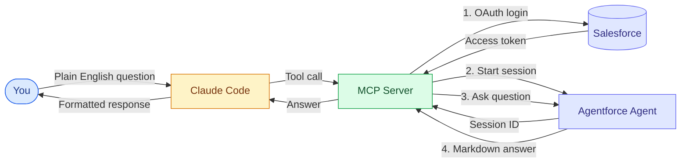

# How Claude Code Talks to Agentforce
### A Plain-English Walkthrough for Business Audiences

---

## The One-Minute Version

> [!NOTE]
> **What this is:** A bridge that lets a developer (or anyone using Claude Code) ask a question in plain English — like *"Summarize the Jennifer Blake account"* — and get back a real answer from a Salesforce **Agentforce agent**, pulling live CRM data.

> [!TIP]
> **Why it matters:** The same Agentforce agent your sales team uses inside Salesforce can now be called from **any tool that speaks MCP** — Claude Code, VS Code, a chatbot, a script, a web app. One agent, many front doors.

---

## The Three Players

| Player | Role | Think of it as… |
|---|---|---|
| **Claude Code** | Where the human types the question | The front desk |
| **MCP Server** | The translator in the middle | The concierge |
| **Agentforce Agent** | The brain that knows your Salesforce data | The specialist in the back office |

---

## The Flow, in Plain English

> [!IMPORTANT]
> **The whole trip takes about 2–4 seconds.** Here's what happens between you hitting Enter and the answer appearing.

### Step 1 — You ask a question
You type into Claude Code:
> *"Summarize the Jennifer Blake account using Agentforce."*

### Step 2 — Claude Code picks the right tool
Claude Code has a catalog of available tools. It recognizes your question is about a Salesforce account summary and reaches for the `get_account_summary` tool.

### Step 3 — The MCP Server gets the call
The MCP server (a small program running locally or in the cloud) receives the request. Its job is to translate the plain-English ask into something Salesforce understands.

### Step 4 — The MCP Server logs into Salesforce
> [!NOTE]
> Behind the scenes, the server uses **OAuth** — the same technology that lets you "Sign in with Google" — to prove to Salesforce it's allowed to ask questions. It gets back a short-lived access token (good for ~25 minutes, then auto-refreshed).

### Step 5 — The MCP Server opens a conversation with the agent
It tells Salesforce: *"Start a new session with the Account Summary agent."* Salesforce returns a **session ID** — think of it as a conversation thread.

### Step 6 — The agent gets the question
The MCP server passes your question into that session: *"Summarize the account named Jennifer Blake."*

### Step 7 — Agentforce does its thing
The agent — which has been pre-configured in Salesforce with knowledge of your data model — runs its playbook:
- Looks up the account record
- Checks open opportunities
- Checks recent cases
- Gathers key contacts
- Calculates closed-won revenue
- Formats everything as readable markdown

### Step 8 — The answer flows back
The agent's response travels back through the MCP server to Claude Code, which displays it to you — complete with tables, headings, and bullet points.

### Step 9 — Cleanup
The MCP server politely closes the session so Salesforce doesn't hold resources open.

---

## The Picture



**Legend**
- **Blue** — the human
- **Yellow** — Claude Code (the front door)
- **Green** — the MCP server (the translator)
- **Indigo** — Salesforce & the Agentforce agent (the brain)

---

## What the Business User Sees

> [!TIP]
> A clean, formatted answer like this:

```
# Account Summary: Jennifer Blake

## Company Info
- Phone: (312) 555-1212
- Billing Location: Chicago, United States

## Top Open Opportunity
| Name                                           | Stage         | Amount    | Close Date |
|------------------------------------------------|---------------|-----------|------------|
| Managed Portfolio Proposal for Jennifer Blake  | Qualification | $72,000   | 2026-10-03 |

## Recent Cases (last 90 days)
- Total: 1 (Working: 1)

## Key Contacts
- Jennifer Blake — jblake1234@example.com
```

No SQL. No clicking through tabs. No training on where to find the data.

---

## Why This Is a Big Deal

> [!IMPORTANT]
> **One agent. Many channels.**
> The same Agentforce agent that answers inside Salesforce can now answer inside developer tools, chat clients, portals, mobile apps — anywhere MCP is supported.

> [!TIP]
> **Reuse, don't rebuild.**
> Instead of building a new integration for every tool that wants Salesforce data, you build the agent once and expose it via MCP.

> [!NOTE]
> **Governance stays in Salesforce.**
> The agent's permissions, data access, and guardrails are configured in Salesforce — not in the client. Change them once, every channel inherits the change.

---

## Security at a Glance

> [!CAUTION]
> This matters for IT review.

| Concern | How it's handled |
|---|---|
| **Who can call the MCP server?** | Optional bearer-token authentication; recommended when the server is exposed over the internet. |
| **How does the server talk to Salesforce?** | OAuth 2.0 Client Credentials flow with a Connected App — no passwords, no long-lived keys in code. |
| **What user does the agent run as?** | A configured "Run-As" user on the Connected App — their permission set controls what the agent can see. |
| **Where do credentials live?** | In a local `.env` file, never committed to source control. |
| **Does the agent see more than it should?** | No — it inherits the Run-As user's data visibility (sharing rules, FLS, record access). |

---

## What Changes for the Business

| Before | After |
|---|---|
| Rep opens Salesforce, clicks through 3 tabs | Rep asks in natural language, gets a summary in 3 seconds |
| Dev builds a new integration per channel | Dev builds the agent once, every channel plugs in |
| Each new tool needs a security review | One MCP server, one review, many consumers |

---

## Common Questions

> [!NOTE]
> **"Is my data leaving Salesforce?"**
> Only the agent's final answer leaves — and only to the client that asked. Salesforce's data stays in Salesforce.

> [!NOTE]
> **"What if the agent is wrong?"**
> The agent is grounded in your CRM — it answers from real records, not from a language model's memory. If a record is wrong in Salesforce, the agent reflects that; fix the record and the agent updates immediately.

> [!NOTE]
> **"How do we add a new capability?"**
> Add a new topic or action to the agent in Agentforce Studio. The MCP server doesn't need code changes — it just forwards whatever question comes in.

> [!WARNING]
> **"What's the catch?"**
> The agent only knows what you've taught it. If you ask it something outside its topics (e.g. HR questions when it's an account-summary agent), it will politely decline. That's a feature, not a bug.

---

## In One Sentence

> [!TIP]
> **Agentforce + MCP = your Salesforce agents become available anywhere a developer or user already works, with security and governance intact.**
